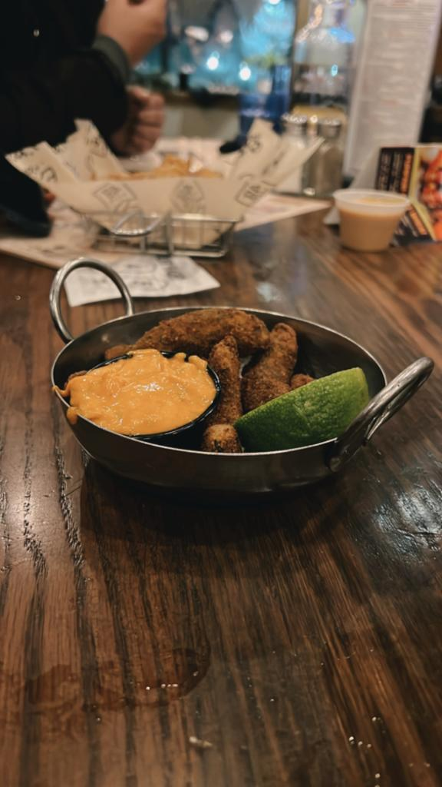

Explore Anchorage

Flightseeing Denali

Explore Seward

Sightseeing in Kenai Fjords

Exploring Fairbanks

Ice Museum

 
&nbsp; &nbsp;
 

Northern Lights

Dog Sledding

Dog-mushing experience outside of Fairbanks is a must do activity in Fairbanks. Taking a trail ride in North Pole involving a dog sled pulled by a team of Alaskan Huskies was the most amazing experience of this trip

Food and Restaurants
- 49th State Brewing - Anchorage

  
&nbsp; &nbsp;
  
&nbsp; &nbsp;
  
&nbsp; &nbsp;
  

Photography. Everywhere!

  
&nbsp; &nbsp;
  
&nbsp; &nbsp;
  

