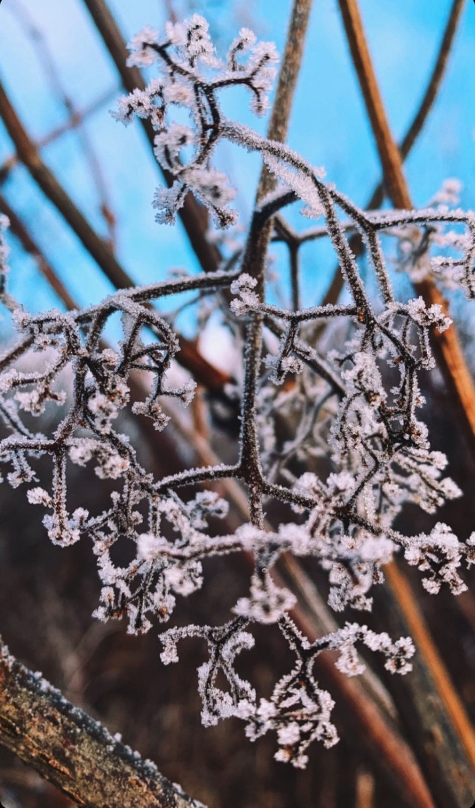

Flightseeing Denali

Explore Seward

Sightseeing in Kenai Fjords

 &nbsp; &nbsp;

 &nbsp; &nbsp;

 ### Ice Museum

 
&nbsp; &nbsp;
 

### Northern Lights

 &nbsp; &nbsp;

&nbsp; &nbsp;

### Dog Sledding

Dog-mushing experience outside of Fairbanks is a must do activity in Fairbanks. Taking a trail ride in North Pole involving a dog sled pulled by a team of Alaskan Huskies was the most amazing experience of this trip

 &nbsp; &nbsp;

 &nbsp; &nbsp;

### Explore Anchorage

Food and Restaurants
- 49th State Brewing - Anchorage

  
&nbsp;
  
&nbsp;
  
&nbsp;
  

### Exploring Fairbanks

At the 2019 rendition of E3, an eccentric gamer in attendance interrupted Keanu Reeves' presentation of the role-playing game (RPG) Cyberpunk 2077,   loudly claiming, “"You're breathtaking,"” which was directed at the actor-cum-presenter.   The image macro used to build the "You're Breathtaking"   meme generally features a still of Keanu Reeves pointing at someone in the audience in front of him -  that someone is Peter Sark, though there are no images from Keanu's point of view that have since been used as part of the   "You're Breathtaking" meme.

 
 
 
 
 
 

### Christmas!!

  
&nbsp; &nbsp;
  
&nbsp; &nbsp;
  

### Photography. Everywhere!

  
&nbsp; &nbsp;
  
&nbsp; &nbsp;
  
&nbsp; &nbsp;
  
&nbsp; &nbsp;
  

